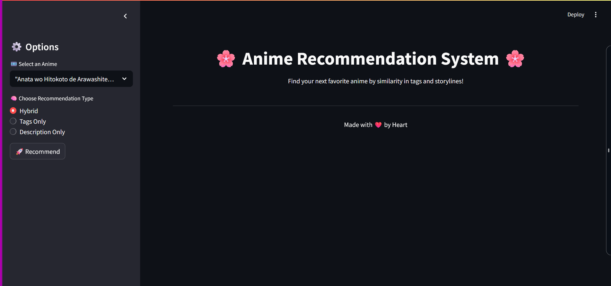

# 🎌 animeXfind – Anime Recommendation System

Welcome to **animeXfind** – your personal anime discovery assistant!  
This smart recommendation system helps users find new anime to watch based on genres, popularity, and similar content.

---
## 📌 Homepage

## 📌 Features

- 🔍 Search anime by name or filter by genre
- 📊 Recommend anime based on similarity or top ratings
- 🧠 Uses content-based filtering for personalized suggestions
- 🌐 Clean and responsive UI for easy interaction

---
---
🚀 How to Run the Project

1. 🔧 Clone the Repository

git clone https://github.com/rahulp00/AnimeXfind.git
cd AnimeXfind

2. 🐍 Set Up Python Environment

If you don't have Jupyter installed:
pip install notebook
Also install other required packages:
pip install pandas numpy scikit-learn

3. 📓 Launch Jupyter Notebook

jupyter notebook
Open the file anime.ipynb from the notebook interface.

📌 Important Notes
.pkl files must be present in the data/ folder. These contain precomputed cosine similarity matrices:
  desc_cosine_sim.pkl – Based on anime descriptions
  tag_cosine_sim.pkl – Based on genre/tags
  hybrid_cosine_sim.pkl – Combined similarity
anime_cleaned.csv should also be in data/ folder. This is the cleaned version of the raw dataset.

   
🧼 Dataset Cleaning Steps (Quick Summary)
The original anime dataset was cleaned as follows:

  Removed null or missing titles, genres, and descriptions.

  Converted all text to lowercase.

  Removed special characters and stopwords.

  Tokenized descriptions for vectorization.

🔮 Features in anime.ipynb

  Search anime by name and get similar recommendations.

  Switch between description-based, tag-based, and hybrid similarity models.

  Easy-to-use interface using Python functions and cosine similarity.

### Requirements

- Python 3.x installed on your system

### Setup Steps

pip install -r requirements.txt

python -m streamlit run app.py

..Author..

Rahul Prajapati
MCA Student 
📍 Gandhinagar, India
📧 rahul38865@gmail.com

